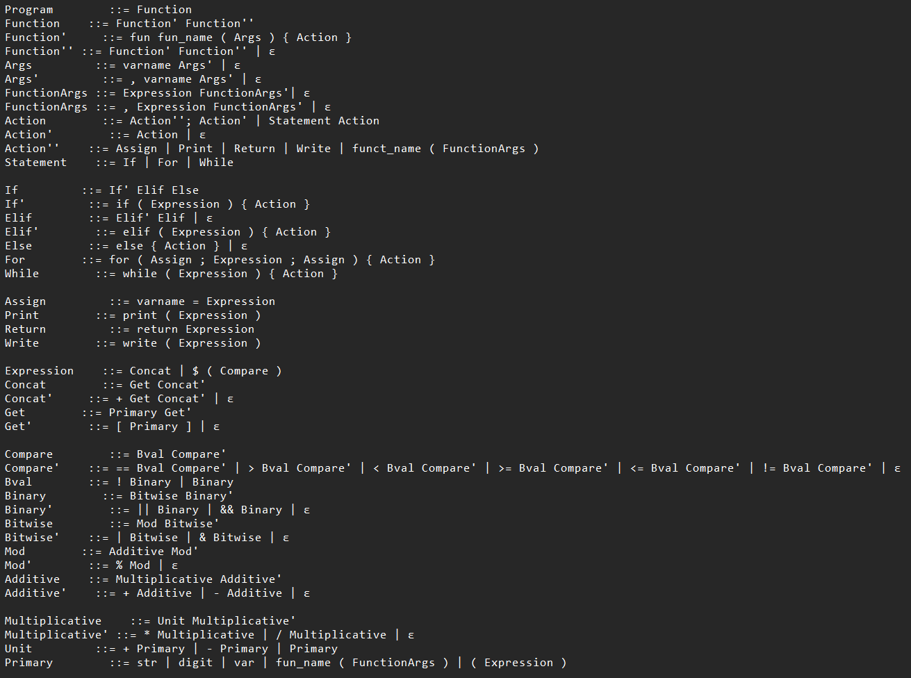

# Welcome to the RockSolid CustomLanguage
Welcome to the repository of the **RockSolid** project. The goal of this project is to develop a custom language
that allows for easy development of GeoJSON constructs. It provides support for multiple language constructs such as 
literals in string and integer form, if statements, while and for loops and functions. The project is developed using Kotlin programming language.
In input.txt you are already provided a working example of code. For more information about how to code in the custom language
you are provided a screenshot below that describes the grammar of the language.

Documentation (in Slovene)
The full project documentation is available on the [GitHub wiki](https://github.com/RockSolidProject/CustomLanguage/wiki) page.